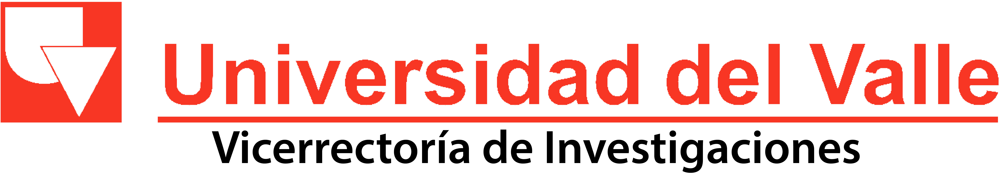

<p align="center">
 
 <br>
 
</p>


<h3 align="center">Sistema integrado de gestión estratégica de laboratorios: SigeLAB</h3>

<div align="center">

  [](https://github.com/siglab/sigelab)
  [](https://github.com/siglab/sigelab/issues)
  [](https://github.com/siglab/sigelab/pulls)
  [](LICENSE)

</div>

---

<p align="center">
  This is a serverless web application built using angular as a web development framework and firebase platform as a backend service, to fulfill the Univalle's laboratories management needs. This application is still under heavy development and constantly improvement.
    <br>
</p>

## 📝 Table of Contents
- [About](#about)
- [Getting Started](#getting_started)
- [Deployment](#deployment)
- [Built Using](#built_using)
- [Acknowledgments](#acknowledgement)
- [Authors](#authors)

## 🧐 About <a name = "about"></a>
This project born as a need of the Universidad del Valle to manage its laboratories facilities, infrastructure and equipments, thinking in SigeLAB as the tool to systematize any service request (from inside of the campus as well as from external users) and generate
management indicators wich make easier to take desitions of investments. Soon we realized this project could be written not only to fill that needs, but also could fill many other universities/institutions needs so we tried to chage not only our data structure but the whole application structure to build a project that could be written to be moddified and replicated in many ways to make it work filling other's similar organizations needs.

## 🏁 Getting Started <a name = "getting_started"></a>
These instructions will let you understand how this project was structured and get you a copy of the project up and running on your local machine for development and testing purposes. See [deployment](#deployment) for notes on how to deploy the project on firebase for a live system.

### Repository structure
    sigelab/
        backend/
            README.md
        documentacion/
            README.md
        frontend/
            angularApp/
            README.md
    .gitignore
    LICENSE
    README.md

This project has a specified repository structure with separated folders for each part of the code. As it was mentioned before, the project is mainly a serverless application, which means that you will find the application core code under ```sigelab/angularApp```. We still keep a backend folder in this repository which is mainly used to keep the code of any application programming interface needed to communicate this application with other systems and the base line data needed to deploy the application. Technical documentation for this application, like basic data structure and system infrastructure graph, can be found under docs folder.

### Prerequisites
In order to setup and run this project you will need:

```
Git
Nodejs v8+ & npm
Firebase CLI
```
To learn how to install or use Firebase CLI [check this out](https://firebase.google.com/docs/cli/?hl=en-419).

### Installing
To install this application, we recommend you to follow the installation guide of the [core angular app](./frontend/README.md) and then, only if it is necesary (at the moment just for Universidad del Valle deployment) continue with the steps in the [backend folder](./frontend/README.md) for the APIs needed.

## 🔧 Running the tests <a name = "tests"></a>
No automated test has been provided for this project at the current state. We are looking to improve this. If you want to contribute to this project in this topic just let us know.

## 🚀 Deployment <a name = "deployment"></a>
Just as for the installation process, we recommend you to follow the deployment guide of the [core angular app](./frontend/README.md) and then, only if it is necesary (at the moment just for Universidad del Valle deployment) continue with the steps specified for deployment in the [backend folder](./frontend/README.md) for the APIs needed.

## ⛏️ Built Using <a name = "built_using"></a>
- [Angular](https://www.angular.io/) - Web framework
- [Firebase](https://firebase.google.com/) - Hosting, user authentication and main database
- [NodeJs](https://nodejs.org/en/) - Server environment for external application programming interfaces

## 🎉 Acknowledgements <a name = "acknowledgement"></a>
- [AdminLTE 2](https://adminlte.io) - Used as WebApp template.
- [CERIF](www.eurocris.org) - An abstraction of this standar was applied to a NoSQL database to give minimum capabilities of communication with other systems.

## ✍️ Authors <a name = "authors"></a>
* **Sebastian Rios** - *Geoprocess S.A.S developer team member* - *Initial work* - [sebaxtian](https://github.com/sebaxtian) - https://about.me/sebaxtian
* **Francisco Hurtado** - *Geoprocess S.A.S developer team member* - *Initial work* - [franciscohurtado](https://github.com/franciscohurtado)
* **Jeff Ramirez** - *Geoprocess S.A.S developer team member* - *Initial work* - [jeferramirez](https://github.com/jeferramirez)
* **Jhon Diaz** - *Geoprocess S.A.S developer team member* - *Initial work* - [jhoncito10](https://github.com/jhoncito10)
* **Ingrid Ruiz** - *Geoprocess S.A.S developer team member* - *Initial work* - [injuli](https://github.com/injuli)
* **Julián Rodríguez** - *Web app architecture design - NoSQL database design*    - [felorodri](https://github.com/felorodri)
* **Julien Wist** - *Project master mind* - [jwist](https://github.com/jwist)


